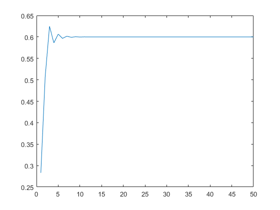
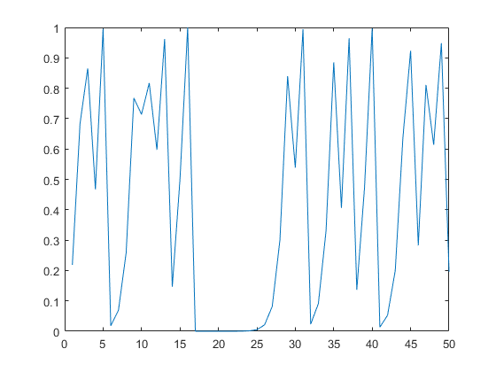
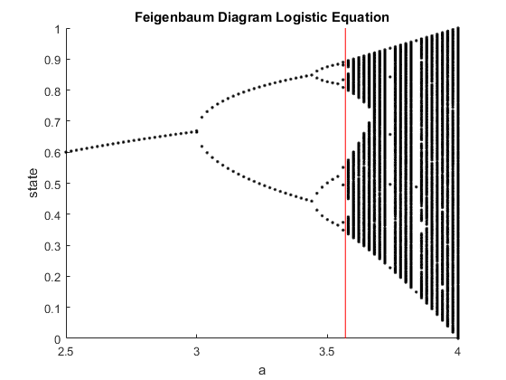
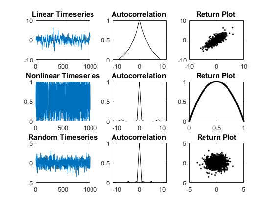

# Non-Linear Techniques 


The common sense what teach us in school generaly bring us a linearity thinking. A sum tend to be better, always more and a subtraction like lose of something is worst. In fact to consilidate an act we need to align our thoughts and focus in one action (or one variable for time to resolve an equation) . Besides linear intuition, unconsciouness thinking brings us a chaos of abstract process that we take time to learn and absorb as a real advantage. 
The most system in real world respect a non-linear dynamics. Linear 
analysis techniques are currently in use (e.g., correlation, similarity) fail to detect 
features and complexities in nonlinearities regimes. 
Non-linear systems are part of complex systems. A large area of knowledge dealing with emerging behaviors:


Systems with complexity are sometimes counter intuitive, have unexpected results and non-trivial behavior.


## Chaos

Chaos are an type of system considered in nonlinear techniques. They have simple periodic behavior to an unpredictable regime. Linear systems are previsible, but in chaos pertubations generate huge differences along the predict outcomes. Whenever errors in linear process grows proportionally with predicted values, in chaos it considered desproportionately changes. 

The following example represent a way to identify an chaotic system: 

### Example for demonstration: Logistic Equation

Logic behavior (or equation): 


Graphical behavior converge to single state (Y axis is 0.6): 


```matlab
%Behavior converge to single state.

%%Script name: logistic_equation

x= (randn(1,50)).^2; %generate time series
a= 2.5;    % decision-maker parameter


for i=2:size(x,2)  %loop to create logistic equation

x(i)= a*x(i-1)*(1-x(i-1));   %Logistic equation 

end

plot (x);
```

    
    





Changing the parameter the same equation has behaviour between two states (Y assumes two states 0.8 and 0.5):  


```matlab
%Changing the parameter has behaviour between two states.

%%Script name: logistic_equation


x= (randn(1,50)).^2; %time series
a= 3.24;    % decision-maker parameter


for i=2:size(x,2)  %loop to creat logistic equation

x(i)= a*x(i-1)*(1-x(i-1));   %Logistic equation 

end

plot (x);
```

    
    


Changing more the parameter the system became chatioc:


```matlab
%Changing more the parameter the system became chatioc

%%Script name: logistic_equation


x= (randn(1,50)).^2; %time series
a= 4;    % decision-maker parameter (bifurcation parameter)


for i=2:size(x,2)  %loop to creat logistic equation

x(i)= a*x(i-1)*(1-x(i-1));   %Logistic equation 

end

plot (x);
```

    
    





### Chaotic map: Feigenbaum Diagram

This map is abifurcation diagram. It represents the chaotic evolution.


```matlab

%Script extrated from [1]: https://booksite.elsevier.com/9780123708670/?ISBN=9780123708670
% pr17_1.m

% Feigenbaum Diagram


msg=('Pls; wait several minutes')
clear;

xn=0.01;
figure; 
hold;
for a=2.5:.02:4;                % range for coefficient a
    for k=1:.1:200              % iterate for 200 steps
        xn=a*xn*(1-xn);         % logistic equation
         if (k>100)             % Do not show initial values <100
            plot(a,xn,'k.');    % Plot the data points
        end;
    end;
end;

liney = [0:0.1:1];  % plot for red line
linex =  ones(size(liney,2))*3.569;

xlabel('a')                     % Provide labels and title
ylabel('state')
title('Feigenbaum Diagram Logistic Equation')
hold on 

plot(linex,liney,'r');

```

    
    msg =
    
        'Pls; wait several minutes'
    
    Current plot held
    
    





Feigenbaum Diagram shows the state evolution of a system according the changes in parameter " a ". Red line is the maker when the system (logic equation) became chatioc. 


```matlab

%Scripts extrated from [1]: https://booksite.elsevier.com/9780123708670/?ISBN=9780123708670

% pr17_3.m
% Linear Time Series
clear;
% Measurement Function and Initial x value
p=0.8;
x1(1)=.1;
for n=2:1000
    x1(n)=p*x1(n-1)+randn(1); % Note the Dynamic Noise Term
end
% Plot Timeseries
figure;
subplot(3,3,1)
plot(x1)
title('Linear Timeseries')
% Autocorrelation
tt=-(length(x1)-1):length(x1)-1;
x1COV=xcov(x1,'coeff');

subplot(3,3,2)
plot(tt,x1COV,'k');
axis([-12 12 0 1]);
title('Autocorrelation ');
% Return Plot
for i=2:length(x1);
    subplot(3,3,3)
    plot(x1(i-1),x1(i),'k.');
    hold on
    
end;
title('Return Plot ');   


% pr17_4.m
% Nonlinear Time Series
clear;
% Measurement Function and Initial x value
p=4.0;
x2(1)=0.35;
for n=2:1000
    x2(n)=p*x2(n-1)*(1-x2(n-1)); % No Dynamic Noise Term
end
% Plot Timeseries
subplot(3,3,4)
plot(x2)
title('Nonlinear Timeseries')
% Autocorrelation
tt=-(length(x2)-1):length(x2)-1;
x2COV=xcov(x2,'coeff');

subplot(3,3,5)
plot(tt,x2COV,'k');
axis([-12 12 0 1]);
title('Autocorrelation ');
% Return Plot

for i=2:length(x2);
    subplot(3,3,6)
    plot(x2(i-1),x2(i),'k.');
    hold on
   
end;
title('Return Plot ');   


% pr17_5.m
% Random Time Series
clear;
x3=randn(1,1000);
% Plot Timeseries
subplot(3,3,7)
plot(x3)
title('Random Timeseries')
% Autocorrelation
tt=-(length(x3)-1):length(x3)-1;
x3COV=xcov(x3,'coeff');
subplot(3,3,8)
plot(tt,x3COV,'k');
axis([-12 12 0 1]);
title('Autocorrelation ');
% Return Plot

for i=2:length(x3);
    subplot(3,3,9)
    plot(x3(i-1),x3(i),'k.');
    hold on
    
end;
title('Return Plot');   
```

    
    





Building...

## References

1._Signal Processing for Neuroscientists, Wim Drongelen, 2006._

